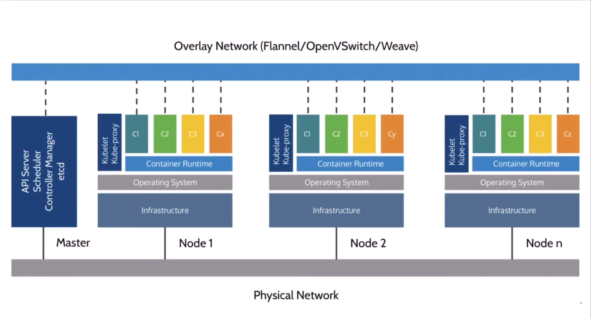
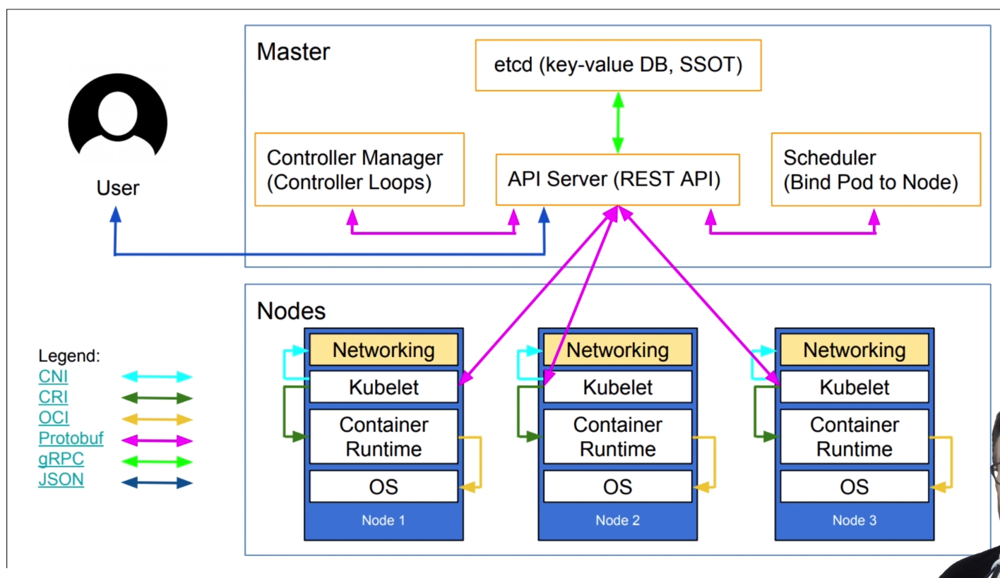

Kubernetes Mastery: Hands-On Lessons From A Docker Captain, Bret Fisher

<details><summary><span style="color: #009900">Kubernetes Architecture</span></summary>

## Kubernetes Architecture


## Kubernetes Physical Architecture


## Shpod Tips and Tricks

Be sure to come back to this lecture later if you have shpod issues, as I've thrown in common hiccups as you use it throughout the course!

- **Tip 1: Namespaces matter!** <br>
Once you learn about namespaces, you know that running kubectl commands often only affects the current namespace. Shpod runs in the shpod namespace, so if you mean to do something with the default namesapce, you need to either ensure that shpod config is set to use the default namespace (which it is by default) or ``` add -n defaul ``` to your commands. So ``` kubectl get pods ``` would turn into ``` kubectl get -n default pods ``` . We've setup the shpod pod to set it's namespace to default though, so this shouldn't be a big issue.

- **Tip 2: DNS matters with Namespaces!** <br>
The above shpod namespace affects DNS as well. If you need to curl or ping a Service name (which you'll learn later), remember that Kubernetes Service DNS names are namespace-sensitive from inside the cluster. Doing a ``` ping myservice ``` from a pod in one namespace only works if that Service is in the same namespace. In the Shpod, you would need to ``` ping mypod.default ``` if that Service was in the default namespace.

- **Tip 3: Attach shows you the console (tty) output**, even from multiple terminals. You can use exec for additional terminal shells <br>
An ``` attach ``` command will show the virtual console of a pod (like a tty), so multiple ``` attach ``` commands in multiple terminal windows will show the same thing because they are both looking at the console output. For your 2nd terminal, you can use an ``` exec ``` command that will start a new shell process in the existing container. This works **exactly** the same way as Docker attach and exec commands: <br><br>
1st window, attach: <br> ``` kubectl attach --namespace=shpod -ti shpod ``` <br><br>
2nd window, create a new bash shell: <br> ``` kubectl exec --namespace=shpod -ti shpod -- bash -l ```

</details>

<details><summary><span style="color: #009900">First Contact with Kubectl</span></summary>

## Getting the nodes
The below command returns an abtracted information about the list of nodes <br>
- ``` kubectl get no ``` or ``` kubectl get node ``` or ``` kubectl get nodes ```

## Obtaining machine-readeable output
**Note:** ``` Kubectl get ``` can output **JSON**, **YAML**, or be directly formatted <br>
- Give us more info about the nodes: <br>
``` kubectl get nodes -o wide  ``` or ``` kubectl get nodes node1 -o wide  ```
- Let's have some YAML <br>
``` kubectl get nodes -o yaml ```

## (AB)using ```kubectl``` and ```jq```
- Show the capcity of all our nodes as a stream of JSON objects: <br>
``` kubectl get nodes -o json | jq ".items[] | {name:.metadata.name} + .status.capacity"```

## For more comprehensive overview, we can use ``` kubectl describe ``` instead
**Note:** Kindly observe that this follows the pattern: <br> ``` kubectl describe resource-type-name/resource-name ``` or ``` kubectl describe resource-type-name resource-name ```
- ``` kubectl describe node/node1 ``` or ``` kubectl describe node node1 ```

## Exploring types and definitions
- We can list all available resource types by running: ``` kubectl api-resources ``` (in Kubernetes 1.10 and prior, this command used to be ``` kubectl get ```)
- We can list one or more resources in the cluster: ``` kubectl get resource-type ``` (this resources can be Pods, Services, Deployments etc) pr ``` kubectl get resource-type resource-name ``` (resource-name is optional and specifies the name of the particular resource)
- We can view the dfefinition for a resource type with: ``` kubectl explain type ```
- we can view the definition for a field in a resource, for instance: ``` kubectl explain node.spec ```
- Or get the list of all fields and subfields" ``` kubectl explain node --recursive ```

## Introspection vs. Documentation
- We can access the same information by reading the [API documentation]()
- The API documentation is usually easier to read but
  - it wont show custom types (like Custom Resource Definitions)
  - we need to make sure that we look at the correct version
- ``` kubectl api-resources ``` and ``` kubectl explain ``` performs introspection (they communicate with the API server and obtain the exact type definition)

## Type Names
- The most common resource names have three forms:
  - singular (e.g. ``` node ```, ``` service ```, ``` deployment ```)
  - plural (e.g. ``` nodes ```, ``` services ```, ``` deployments ```)
  - short (e.g. ``` no ```, ``` svc ```, ``` deploy ```)
- Some resources do not have a short name
- ``` Endpoints ``` only have a plural form (because even a single ``` Endpoints ``` resource is actually a list of endpoints)

## Namespaces
Namespaces allows us to segregate resources.
- ``` kubect get namespaces ```
- ``` kubect get namespace ```
- ``` kubect get ns ```

## Accessing namespaces
- By default, ``` kubectl ``` uses the ``` default ``` namespace
- We can see resources in all namespaces with ``` --all-namespaces ``` (since kubernetes 1.14, we can also use ``` -A ``` as a shorter version)

## What are all these control plane pods?
- ``` etcd ``` is our etcd server
- ``` kube-apiserver ``` is the API server
- ``` kube-controller-manager ``` and ``` kube-scheduler ``` are other control plane components
- ``` coredns ``` provides DNS-based service discovery (replacing ``` kube-dns ``` as of 1.11)
- ``` kube-proxy ``` is the (per-node) component managing the network port mappings and such
- ``` <net name> ``` is the optional (per node) component managing the network overlay
- the ``` READY ``` column indicates the number of containers in each pod <br>
**Note:**
- this only shows containers, you won't see host svcs (e.g. mcirok8s)
- you may see different namespaces depending on setup

## Newer namespaces
``` kube-public ``` is created by our installer & **used for security bootstrapping** <br>example: list the pods in ```kube-public``` namespace <br>
- ``` kubectl-n kube-public get pods ```

The only interesting object in ``` kube-public ``` is a ConfigMap named ``` cluster-info ```

```
Example:
- List ConfigMap objects:
  kubct -n kube-public get ConfigMap

- Inpect cluster-info
  kubectl -n kube-public get ConfigMap cluster-info -o yaml
```
Note the ``` selfLink ``` URL: ``` /api/v1/namespaces/kube-public/configmaps/clusterinfo ``` we can use that (later in ``` kubectl context ``` lectures)
</details>